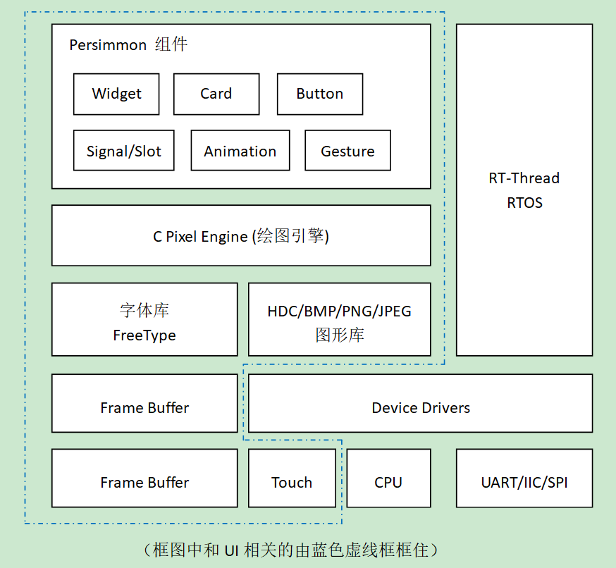
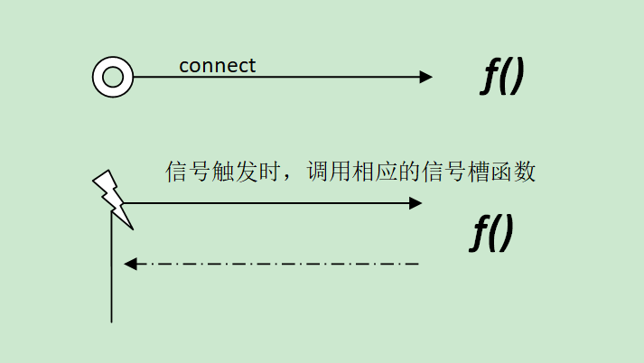

# Persimmon UI

## 1、Persimmon简介

Persimmon是一套运行在RT-Thread嵌入式实时操作系统上的图形用户界面组件，用于提供用户交互，并按照LCD & Touch的方式对操作进行优化，更贴近现代化的图形用户界面。

Persimmon的结构框图如下图所示：



Persimmon采用C++语言编写，基于底层C代码的底层图形像素引擎，为上层应用提供了控件、窗口，signal/slot，手势动画等机制。所有的Persimmon C++代码都在Persimmon这个名字空间内，所以在使用Persimmon时，需要使用

```namespace
using namespace Persimmon;
```

或使用

```namespace
Persimmon::Application
```

方式来引用其中的类。

## 2、底层绘图

Persimmon底层绘图使用的是RT-Thread的底层C代码的绘图引擎，主要是DC部分操作。DC全称是Device Context，即（绘图）设备上下文。它包括了三种绘图设备：

- Hardware DC
- Client DC
- Buffered DC

几种绘图设备，他们的绘图操作都可以使用头文件

```dc
rtgui/dc.h
```

中定义的DC操作函数，该头文件中的API是DC绘图的核心API，其他API基本都是依赖于以上的API。

在Persimmon中，一般来说不需要操作到DC这一层，但也有些情况是例外的，例如说需要自定义控件的绘图外观。对于`Persimmon::Widget`，控件外观的绘图操作会归结到调用`render`方法：

```render
virtual void render(struct rtgui_dc* dc, const Point &dcPoint = Point(),const Rect &srcRect = Rect(), RenderFlag flags = DrawNormal)
```

参数描述：

- dc, 进行绘图的目标设备上下文；
- dcPoint, 目标设备上下绘图时的起始坐标点；
- srcRect, 需要绘制控件的矩形区域；
- flags, 绘图时的参数。

在这个`render`方法中，实际可以进行绘制的设备上下文由dc参数指定，在这个上面可以使用DC绘图相关的API进行绘图。

## 3、signal/slot机制

在Persimmon中，为了便于把用户动作和UI事件关联起来，所以实现了 [信号 -> 信号槽] 的机制，即：当一个信号触发了时，Persimmon会自动调用到信号槽里关联的函数。类似程序中的，开发人员可以把一个函数绑定到一个信号上，当信号触发时，绑定的函数被回调。



### 3.1 信号/信号槽绑定

使用信号/信号槽时，请注意它的绑定方法：

```connect
void connect(T* pObj, void (T::*func)(void));
```

在这个绑定方法中，pObj是绑定的T类型对象；func是T类下的方法。类似于它一定是绑定到对应对象下的某个对应方法，如果两者不一致，在编译阶段就会报错。

### 3.2 信号传递的参数

有的时候我们可能会传递一些参数给信号槽里绑定的函数，例如当回调信号槽函数时希望把一个整数，一个字符串传递给信号槽，可以以一下方式：

- 信号端：

```signal
class ValueButton : public Button
{
public:
    ValueButton(const char* text);

    virtual rt_bool_t onClickEvent(struct rtgui_event* event) 
    {
        clicked(10, text); /* 调用信号槽函数，传递10, text参数 */
    }

    Signal <int, char*> clicked;
};
```

- 信号槽接收端：

```signal
class A
{
public:
    A()
    {
        ValueButton *btn = new ValueButton("Hello");
        btn->clicked.connect(this, &A::onButton);
    }

    void onButton(int value, char *str)
    {
        printf("clicked: value = %d, str=%s\n", value, str);
    }
};
```

在信号槽接收端，要对对应的信号进行绑定时，相应的信号槽函数参数需要一致，所以这里的`onButton`的函数参数`（int value, char *str）`，同时这些参数由发起信号的信号端传递相应的参数。

## 4、Persimmon 控件列表

- [Page 控件](./doc/Widget/Page/README.md)

    Page 控件（Page 类）是一个窗口的全覆盖控件，从 Container 控件（Container 类）派生得来。
