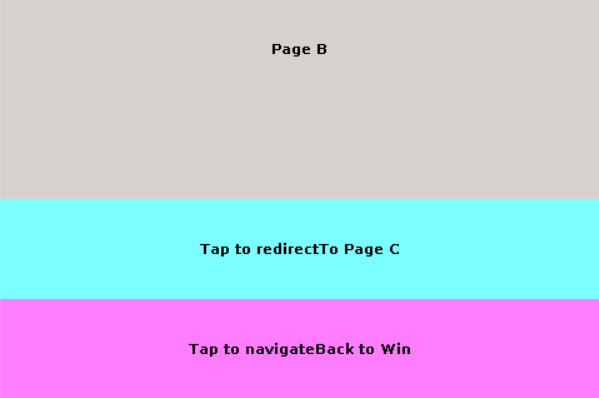

# Page Widget

## 1、介绍

 Page 控件（Page 类）是一个窗口的全覆盖控件，从 Container 控件（Container 类）派生得来。

代码文件如下：

```code
include/pm_page.h
src/pm_page.cpp
```

### 1.1 Page 类成员函数

Page切换动画类型变量定义为枚举类型如下：

```C
enum AnimType
{
    AnimNone = 0x00,
    AnimFade = 0x01,
    AnimMove = 0x02,
    AnimMoveTop = 0x04,
    AnimMoveBottom = 0x08,
    AnimMoveLeft = 0x10,
    AnimMoveRight = 0x20,
};
DEFINE_CLASS_ENUM_FLAG_OPERATORS(AnimType);
```

- AnimNone 无切换动画
- AnimFade 使能淡入或淡出动画
- AnimMove 使能动画移动
- AnimMoveTop 配置移动动画由上往下方向进行
- AnimMoveBottom 配置移动动画由下往上方向进行
- AnimMoveLeft 配置移动动画由左往用方向进行
- AnimMoveRight 配置移动动画由由往左方向进行

`注：淡入或淡出动画和移动动画可同时使能`

Page 类成员函数原型如下所示：

```C
Page(Window *win);
virtual ~Page();

void navigateTo(Page *page);
void redirectTo(Page *page);
void doJumpAnimShow(Page *page);
Page* navigateBack(bool update = true);
void navigateBack(unsigned int num, bool update = true);
Page* getCurrentPage(void);
Page* getLastPage(unsigned int index = 1);
unsigned int getPageSize(void);
Window* getPageWin(void);
void setAnimation(enum AnimType type, rt_uint16_t frames, rt_uint16_t frameInterval, bool fadeOut = true);
```

- Page(Window *win);

    描述：构造函数，用于创建一个空白页面。

    | 参数  | 描述 |
    | -    | -    |
    | win | 新创建的页面所在窗口 |

- virtual ~Page();

    描述：析构函数，页面释放。

- void navigateTo(Page *page);

    描述：页面跳转函数，用于保留当前页面的情况下跳转到新页面。

    | 参数  | 描述 |
    | -    | -    |
    | page | 跳转并用来显示的新页面 |

- void redirectTo(Page *page);

    描述：页面跳转函数，用于关闭当前页面后跳转到新页面。

    | 参数  | 描述 |
    | -    | -    |
    | page | 跳转并用来显示的新页面 |

- void doJumpAnimShow(Page *page);

    描述：运行页面跳转动画，无动画则只做刷新。

    | 参数  | 描述 |
    | -    | -    |
    | page | 跳转并用来显示的新页面 |

- Page* navigateBack(bool update = true);

    描述：关闭当前页面，返回上一级页面。

    | 参数  | 描述 |
    | -    | -    |
    | update | 是否刷新返回的一级页面显示 |

- void navigateBack(unsigned int num, bool update = true);

    描述：关闭当前页面或多级页面并返回到对应页面。

    | 参数  | 描述 |
    | -    | -    |
    | num | 关闭并返回的页面深度，默认为关闭返回一级页面 |
    | update | 是否刷新返回的一级页面显示 |

- Page* getCurrentPage(void);

    描述：获取当前显示页面并返回。

- Page* getLastPage(unsigned int index = 1);

    描述：获取当前显示页面的上一级页面或多级页面并返回。

- unsigned int getPageSize(void);

    描述：获取当前窗口页面深度。

    | 返回值  | 描述 |
    | ---     | ---- |
    | unsigned int | 无符号整型，值大小即为当前窗口中的页面总个数 |

- Window* getPageWin(void);

    描述：获取当页面所在窗口。

    | 返回值  | 描述 |
    | -    | -    |
    | Window* | 窗口类指针 |

- void setAnimation(enum AnimType type, rt_uint16_t frames, rt_uint16_t frameInterval, bool fadeOut = true);

    描述：设置该页进入或关闭时的动画效果。

    | 参数  | 描述 |
    | -    | -    |
    | type | 动画类型,可设置的值如`AnimFade、AnimMove、AnimFade | AnimMove | AnimMoveTop`等 |
    | frames | 该次动画的帧数 |
    | frameInterval | 动画帧间隔，单位毫秒，数值需为系统`tick`时间整数倍 |
    | fadeOut | 动画淡入或淡出效果，默认 `true` 淡出，`false` 为淡入 |

    示例：`setAnimation(AnimFade | AnimMove | AnimMoveTop， 10， 50， true);`

## 2、示例介绍

Page 控件使用示例，由一个窗口和三个 Page 构成。三个 Page 分别为 Page A 、 Page B 、 Page C。

该示例窗口和Page间相互跳转逻辑如下：


### 3.1 获取使能示例

- 使用 menuconfig 进入 Persimmon demo 选择框

```menuconfig
  Privated Packages of RealThread  --->
      [*] Persimmon Source Package  --->
            Persimmon demo (Page Widget)  --->
```

- 配置示例选择为 `Page Widget`


- 示例代码构成

```code
example/page/main_win.cpp
example/page/main_win.h
example/page/page_a.cpp
example/page/page_a.h
example/page/page_b.cpp
example/page/page_b.h
example/page/page_c.cpp
example/page/page_c.h
example/page/rtgui_main.c
example/page/rtgui_main.h
```

### 2.2 运行示例

- demo 启动后空窗口显示如下：


- demo 跳转到 A 页面后显示如下：


- demo 跳转到 B 页面后显示如下：



- demo 跳转到 C 页面后显示如下：


